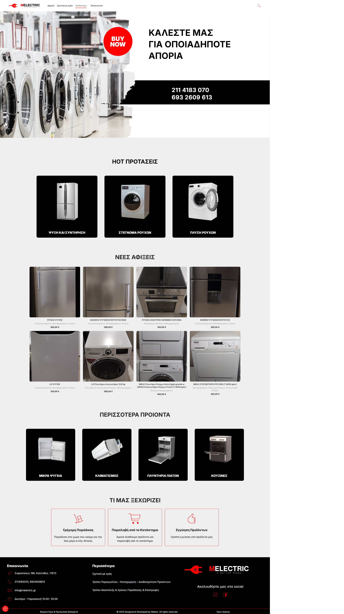
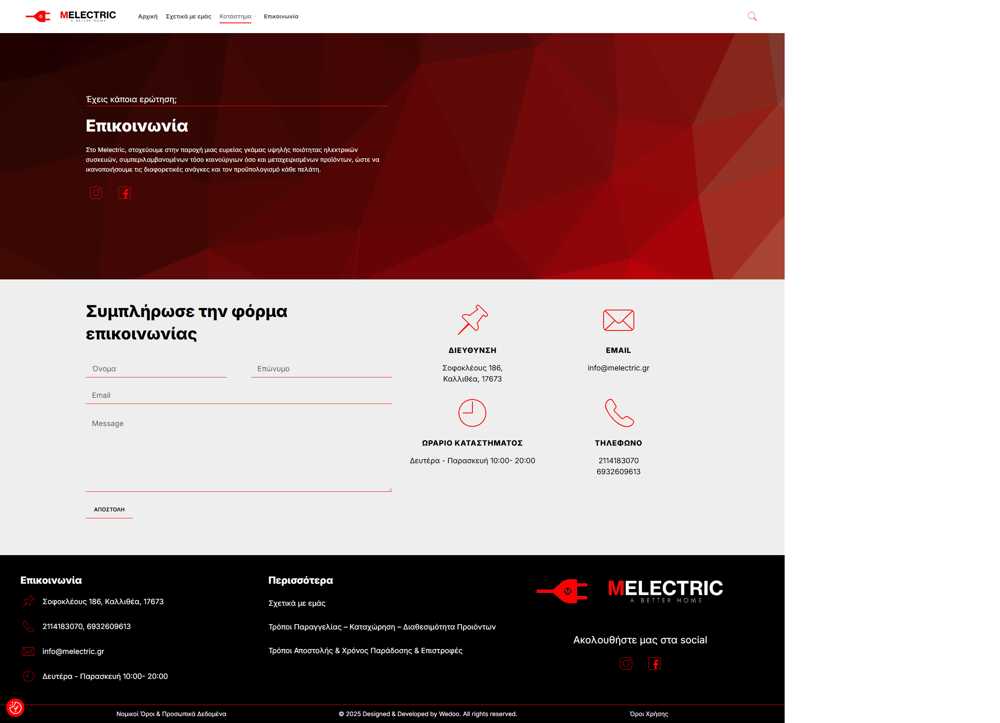
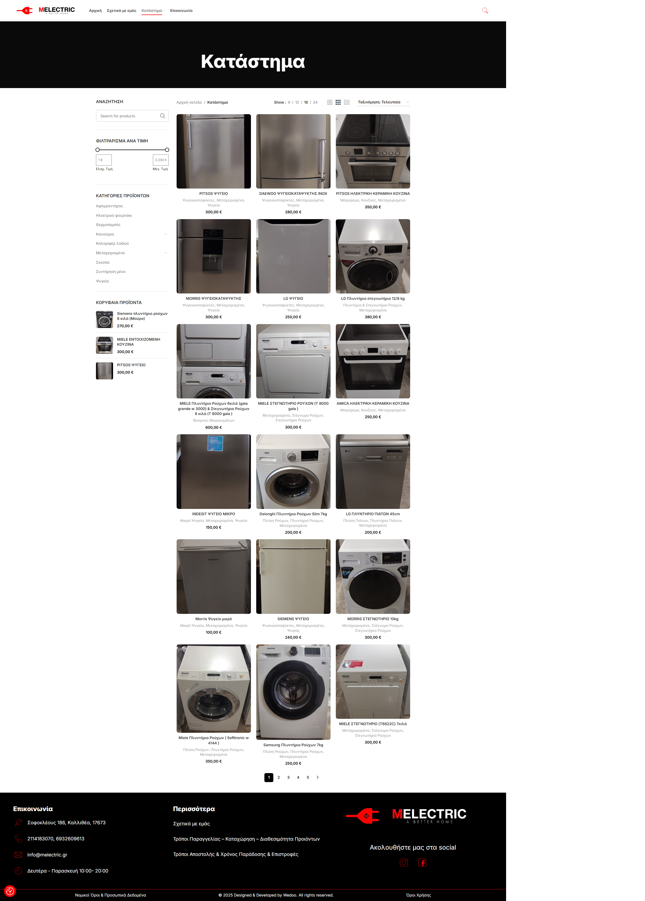
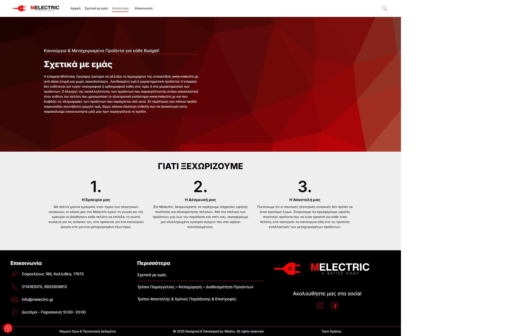

## Live Website
[View Live Site](https://melectric.gr/)

## Overview 
This is a website I developed while working for Wedoo Digital Agency.
I was responsible for setting up the site from scratch along with a figma template. While creating this project I came against a lot of tasks since this was a very demanding customer and they came with extra data entry almost every day, nevertheless the project was finished on time.

## My Role
- Front-end development
- Responsive layout
- Performance optimization
- Search Engine Optimization
- Mass data entry

## Tech Stack
- HTML
- CSS
- Javascript
- Wordpress along with Elementor
- Figma

## Screenshots 

---

---

---

---

## Note
The source code belongs to the company and is not included here.
